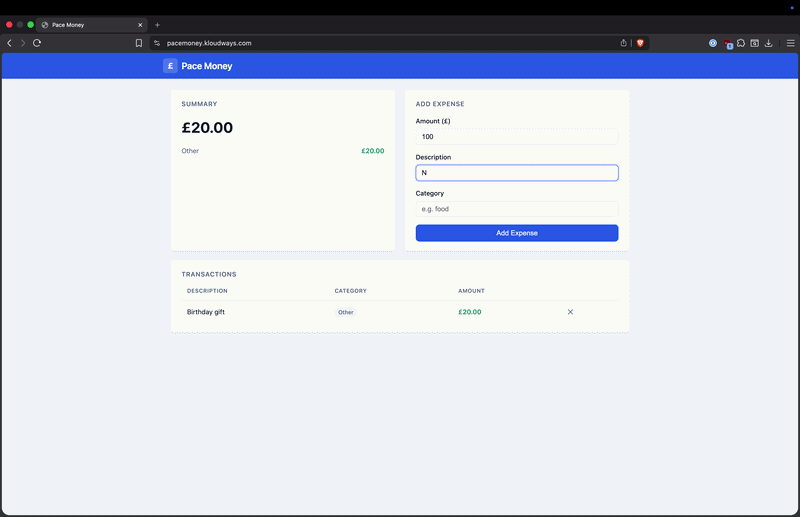

# pacemoney-app

Application code, container image, Helm chart, CI pipeline, and GitOps delivery configuration for the Pace Money portfolio project. The application is a FastAPI expense tracker with a responsive web frontend, backed by PostgreSQL in production and SQLite in local development and tests.

## Demo



## Repository structure

```
pacemoney-app/
├── app/
│   ├── main.py             # FastAPI application, routes, lifespan (runs Alembic on startup)
│   ├── database.py         # SQLAlchemy engine and session factory
│   ├── models.py           # ORM models
│   └── static/             # Web frontend (index.html, style.css, app.js)
├── alembic/
│   ├── env.py              # Alembic env: reads DATABASE_URL, targets Base.metadata
│   └── versions/
│       ├── 0001_initial_schema.py   # Creates transactions table
│       └── 0002_add_created_at.py   # Adds created_at column
├── alembic.ini             # Alembic configuration
├── tests/
│   ├── conftest.py         # Session-scoped fixture: drops and recreates DB tables
│   └── test_health.py      # Tests for /health, /metrics, /transactions
├── deploy/
│   ├── helm/
│   │   └── pacemoney/      # Helm chart
│   │       ├── Chart.yaml
│   │       ├── values.yaml
│   │       ├── values.prod.yaml
│   │       └── templates/
│   │           ├── deployment.yaml
│   │           ├── service.yaml
│   │           ├── servicemonitor.yaml   # Prometheus ServiceMonitor
│   │           ├── secretstore.yaml      # ESO SecretStore (AWS Secrets Manager)
│   │           ├── externalsecret.yaml   # ESO ExternalSecret → Kubernetes Secret
│   │           └── grafana-dashboard.yaml  # Grafana dashboard ConfigMap (sidecar discovery)
│   └── argocd/
│       └── application.yaml  # ArgoCD Application manifest
├── docs/
│   ├── pipeline.md         # CI/CD pipeline documentation
│   ├── issues-log.md       # Issues encountered per phase
│   └── adr/                # Architecture decision records
├── Dockerfile
├── Jenkinsfile
├── requirements.txt        # All dependencies (dev + prod)
├── requirements-prod.txt   # Production dependencies only
└── sonar-project.properties
```

## Delivery model

**Jenkins** builds, tests, and publishes. **ArgoCD** deploys.

1. A code push to `main` triggers the Jenkins pipeline
2. Jenkins runs tests, security scans, builds the Docker image, and pushes it to ECR
3. Jenkins commits the new image tag to `deploy/helm/pacemoney/values.yaml` and pushes to `main`
4. ArgoCD detects the change (polls every 3 minutes) and syncs the Helm release to the cluster

The database secret is never passed through Jenkins. The External Secrets Operator reads it from AWS Secrets Manager and creates a Kubernetes Secret in the `pacemoney` namespace.

On pod startup, the lifespan event runs `alembic upgrade head` to apply any pending database migrations before the application begins serving traffic.

## Running locally

```bash
python3 -m venv .venv
source .venv/bin/activate
pip install -r requirements.txt
uvicorn app.main:app --reload
```

The application starts on `http://localhost:8000`. The web frontend is served at `/`. Without `DATABASE_URL` set, it uses SQLite (`./pacemoney.db`). Alembic will run migrations against SQLite on startup.

## Running tests

```bash
python3 -m venv .venv
source .venv/bin/activate
pip install -r requirements.txt
pytest tests/ -v
```

## Environment variables

| Variable | Required | Default | Description |
|----------|----------|---------|-------------|
| `DATABASE_URL` | No | `sqlite:///./pacemoney.db` | SQLAlchemy connection string. In Kubernetes, injected from the Secret created by ESO. |

## API endpoints

| Method | Path | Description |
|--------|------|-------------|
| GET | `/` | Web frontend (responsive HTML/CSS/JS expense tracker UI) |
| GET | `/health` | Returns `{"status": "ok", "app": "pacemoney", "version": "2.0.0"}` |
| GET | `/metrics` | Prometheus metrics (via prometheus-fastapi-instrumentator) |
| GET | `/transactions` | List all transactions |
| GET | `/transactions/summary` | Total spend and per-category breakdown |
| GET | `/transactions/{id}` | Fetch a single transaction by ID (404 if not found) |
| POST | `/transactions` | Create a transaction |
| DELETE | `/transactions/{id}` | Delete a transaction |

## Helm chart

The chart is in `deploy/helm/pacemoney/`. The database secret is managed by ESO — it is not passed as a Helm value.

| Value | Default | Description |
|-------|---------|-------------|
| `image.repository` | ECR repository URL | Container image repository |
| `image.tag` | `latest` (updated by Jenkins) | Image tag |
| `replicaCount` | `2` | Number of pod replicas |
| `externalSecret.region` | `eu-west-2` | AWS region for Secrets Manager |
| `externalSecret.secretName` | `pacemoney/db-url` | Secrets Manager key |
| `service.type` | `NodePort` | Kubernetes Service type |
| `service.port` | `80` | Service port |
| `app.port` | `8000` | Container port |

## Jenkins pipeline

See `docs/pipeline.md` for a full description of all pipeline stages.

Required Jenkins credentials:

| Credential ID | Type | Description |
|--------------|------|-------------|
| `sonar-token` | Secret text | SonarCloud analysis token |
| `github-token` | Username+Password | GitHub username + Personal Access Token (`repo` scope) — used to push image-tag commits |

## ArgoCD

The `deploy/argocd/application.yaml` manifest configures ArgoCD to watch the `main` branch of this repository and automatically sync the `deploy/helm/pacemoney` Helm chart to the `pacemoney` namespace. Apply it once after ArgoCD is installed:

```bash
kubectl apply -f deploy/argocd/application.yaml
```

ArgoCD's `automated` sync policy with `prune: true` and `selfHeal: true` means the cluster state is continuously reconciled with git.

## Documentation

| Document | Contents |
|----------|----------|
| `docs/pipeline.md` | All pipeline stages, credentials, and skip behaviour |
| `docs/issues-log.md` | Issues encountered per phase and their fixes |
| `docs/adr/` | Architecture decision records |
